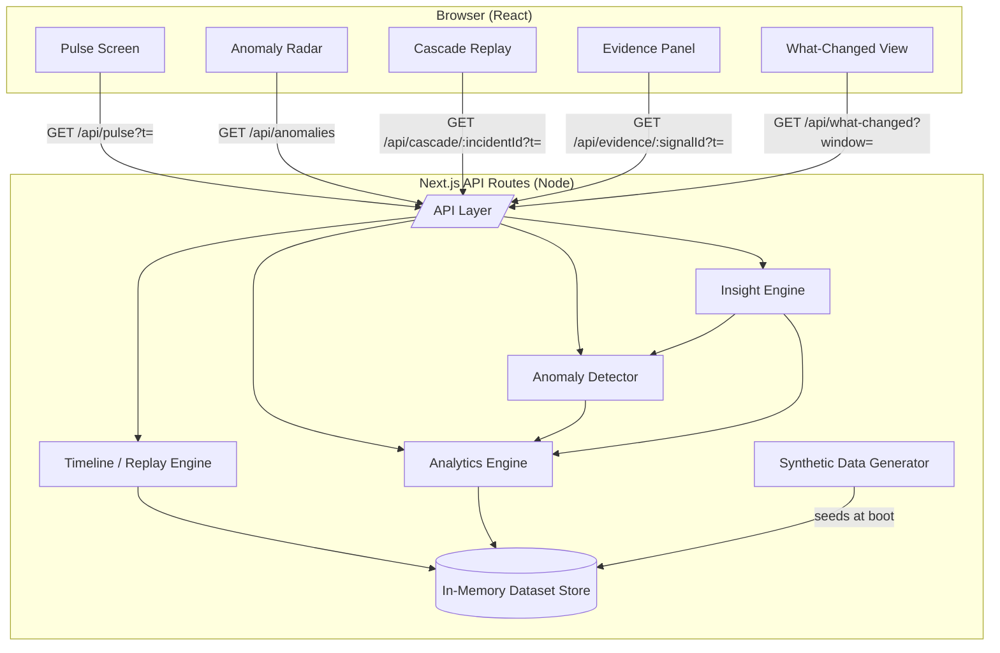

# TECHNICAL_ARCHITECTURE.md — DataPulse

> Scope reminder: this describes a **demo/prototype architecture**. It intentionally avoids streaming infrastructure, distributed systems, and ML pipelines. All "real-time" behavior is simulated playback of a deterministic synthetic dataset.

## 1. System Architecture Overview

DataPulse is a single Next.js application (frontend + API routes) backed by an **in-memory dataset store**, generated once at server start from a seeded synthetic-data generator. No external services, message queues, or databases are required to run the demo.

```
Browser (React / Next.js client)
        │  fetch (REST-ish JSON over Next.js API routes)
        ▼
Next.js API Routes (Node runtime)
        │
        ├── Synthetic Data Generator (seeded, deterministic)
        │        └── produces Metrics[], Events[], ground-truth Incident[]
        │
        ├── In-Memory Data Store (arrays / Maps, optionally mirrored to SQLite file)
        │
        ├── Analytics Engine (rolling stats, z-score, rate-of-change, correlation)
        │
        ├── Anomaly Detector (thresholds over analytics engine output → Anomaly[])
        │
        ├── Insight Engine (InsightProvider interface)
        │        ├── DeterministicInsightProvider  (MVP, default, no API key)
        │        └── LLMInsightProvider             (optional, P2, requires key)
        │
        └── Replay/Timeline Engine (maps a simulated clock → dataset slice)
```

### Why this shape

- **Next.js (React + API routes) monolith** — a single deployable unit is the fastest path to a credible, interactive demo; no service-to-service network calls to reason about or secure.
- **In-memory store, generated at boot** — deterministic seed means identical results every run; no database setup step; trivially resettable. An optional SQLite file-backed mode is described below for teams who want persistence across server restarts, but it is not required for MVP.
- **Analytics/detector/insight layers as plain TypeScript modules**, not services — keeps the "pipeline" structure visible in code (mirrors the RAW DATA → ... → ACTIONABLE INSIGHTS pipeline from the product concept) without operational overhead.
- **No Kafka/Kubernetes/Spark** — there is no real streaming source and no real scale requirement; introducing them would only add unjustified complexity and would misrepresent the demo as production infrastructure.

## 2. Mermaid Architecture Diagram



## 3. Frontend

- **Framework**: Next.js (App Router) + React + TypeScript.
- **Styling**: Tailwind CSS with a small dark "control room" design-token set (see `FRONTEND_SPEC.md`).
- **Charts/graph**: lightweight SVG-based rendering (custom or a minimal charting lib) for sparklines; the Cascade Replay node graph is custom SVG so node states and animated edges can be driven directly by replay state.
- **State management**: React state + context for the simulated clock (`currentTime`), playback state (`playing`, `speed`), and selected anomaly/incident. No external state library needed at this scale (Zustand acceptable if the team prefers, but not required).
- **Data fetching**: simple `fetch` calls to internal API routes, revalidated on clock tick; no need for a heavier data-fetching library at this scope, though SWR/React Query are acceptable substitutes.

## 4. Backend

- **Runtime**: Next.js API routes (Node.js), colocated with the frontend — no separate backend service.
- **Responsibilities**: serve dataset slices for a given simulated time, run analytics on demand, return detected anomalies, return generated insights, return evidence detail, return what-changed comparisons.
- **Statelessness**: API routes are stateless per request; the dataset store is a module-level singleton built once at process start (acceptable for a demo process; see Section 10 Persistence for the caveat).

## 5. Data Model

Four core entities, held as in-memory arrays (and mirrored 1:1 if the optional SQLite mode is used):

```
MetricPoint {
  id: string
  timestamp: string (ISO 8601)
  metric: enum(traffic, checkout_latency_ms, payment_failure_rate,
               conversion_rate, error_rate, revenue_index)
  region: enum(NA, EU, APAC, LATAM)
  value: number
}

EventPoint {
  id: string
  timestamp: string (ISO 8601)
  type: enum(deploy, promo, config_change, external_note)
  region: enum | null
  label: string
}

Anomaly {
  id: string
  metric: enum
  region: enum
  startTime: string
  endTime: string | null   // null while ongoing
  severity: number (0-100)
  confidence: number (0-100)
  status: enum(forming, active, critical, resolved)
  triggeringCriteria: string[]   // e.g. ["z-score>3", "rate-of-change>0.4"]
}

Incident {
  id: string
  label: string
  region: enum
  stages: IncidentStage[]        // ground-truth stage list, see below
  anomalyIds: string[]           // links to detected Anomaly records
}

IncidentStage {
  timestamp: string
  metric: enum
  description: string            // e.g. "Traffic spike begins"
}
```

The `Incident.stages` array is the **ground-truth script** used by the synthetic generator to inject the designed multi-stage incident; the `Anomaly[]` records are **independently computed** by the Anomaly Detector from the raw `MetricPoint[]`, so the demo can show that detection matches the designed narrative without the narrative being hardcoded into the detector.

## 6. Synthetic Data Generator

- Pure-function, seeded PRNG (e.g., mulberry32 or similar small deterministic generator) — same seed always produces the same dataset.
- Generates 24 simulated hours at 1-minute resolution per (metric × region) = 6 × 4 × 1440 ≈ 34,560 `MetricPoint`s.
- Composition per series: `baseline(time-of-day) + seasonal(sinusoidal daily curve) + noise(bounded random) + incidentDelta(if within scripted incident window)`.
- The one designed incident (Section 4 of PRD) is injected as an explicit `incidentDelta` function keyed to the APAC region and the six-stage timestamp script — this is the "at least one multi-stage incident" and "correlated events" requirement.
- A handful of smaller, non-escalating "blips" are also seeded (e.g., a brief EU latency wobble that stays within normal variance) to demonstrate the detector does *not* over-fire — this satisfies "normal periods" and "noise" without becoming a second full incident.
- Output is generated once at server boot and cached in memory.

## 7. Analytics Engine

Pure, unit-testable functions operating on `MetricPoint[]` for a given (metric, region):

- `rollingMean(window)`, `rollingStdDev(window)` — default window: 15 minutes.
- `zScore(current, rollingMean, rollingStdDev)`.
- `percentChange(current, previous)` and `percentChangeVsBaseline(current, priorDaySameTime)`.
- `rateOfChange(window)` — slope over the trailing N minutes, catches fast-forming spikes before z-score alone would.
- `correlate(signalA, signalB, maxLagMinutes)` — bounded cross-correlation used only to propose cascade edges within a short lag window (0–10 min), not a general causal claim.

All functions are deterministic and side-effect free; the Evidence Panel calls these same functions live (not a cached "explanation string") so the numbers shown to the operator are always the real computed values.

## 8. Anomaly Detection

A signal at time *t* is flagged when **at least two** of the following independently agree (this multi-criteria requirement satisfies "not simply value > hardcoded threshold"):

1. `|zScore| > 3` against the rolling baseline.
2. `rateOfChange` exceeds a per-metric slope threshold within a 5-minute window.
3. `percentChangeVsBaseline` (vs. prior-day same time) exceeds a per-metric percentage threshold.

`severity` = weighted combination of magnitude of the above three signals, scaled 0–100.
`confidence` = count of criteria that agree (1, 2, or 3) mapped to a 0–100 scale, boosted slightly if a correlated upstream signal is also currently anomalous (see `correlate`).

Cascade edges (for the Cascade Replay graph) are proposed when two anomalous signals in the same region show a positive `correlate` score within a short lag window — e.g., `traffic → checkout_latency_ms → payment_failure_rate → conversion_rate`. This is disclosed in the UI as **"statistically correlated, not proven causal."**

## 9. Insight Generation

`InsightProvider` interface (TypeScript):

```ts
interface InsightProvider {
  generate(incident: Incident, evidence: EvidenceBundle): Insight;
}
```

- **`DeterministicInsightProvider`** (MVP default, no API key required): fills a small set of sentence templates with real computed values, e.g. *"Checkout latency in APAC increased {pctChange}% beginning at {time}, followed {lagMinutes} minutes later by a {pctChange2}% increase in payment failures in the same region."* Every inserted value comes from the Analytics Engine output for that specific incident — never static copy.
- **`LLMInsightProvider`** (optional, P2, explicitly out of MVP unless a stakeholder decision pulls it in — see PRD Section 15): would call an LLM to phrase a narrative summary from the same evidence bundle. If implemented, the UI must visibly label output as "AI-generated summary" and must never be used for the deterministic detection logic itself — detection stays deterministic regardless of which provider is active.
- The app **must run fully with `DeterministicInsightProvider` and zero API keys.**

## 10. Timeline / Replay Engine

- A single `currentTime` value (simulated clock) drives every screen.
- Playback modes: `paused`, `playing @ 1x/4x/30x`, or manual scrub (drag on timeline).
- `GET /api/pulse?t=<ISO time>` and related endpoints return the dataset **state as of `t`** (i.e., only data up to that timestamp is "known" to the UI), which is what makes the Cascade Replay feel like a reconstruction rather than a chart with a moving cursor.
- Replay is fully reversible (scrub backward) because the underlying dataset is static and pre-generated — there is no actual stream to "rewind."

## 11. State Management

- Client: React Context holding `{ currentTime, playbackSpeed, isPlaying, selectedIncidentId, selectedSignalId }`.
- Server: stateless per-request computation over the shared in-memory store; no server-side session state required for MVP (no auth, no per-user state — see `SECURITY_AND_ACCESS.md`).

## 12. Persistence

- **MVP**: in-memory only, regenerated deterministically on server start (same seed ⇒ identical dataset). Acceptable because the dataset is synthetic and reproducible — there is nothing to "lose."
- **Optional (P1)**: mirror the generated dataset into a local SQLite file (`better-sqlite3`) at boot, so restarts don't need to regenerate, and so the analytics engine can be demoed against parameterized SQL queries (all via prepared statements — see `SECURITY_AND_ACCESS.md`). This is a nice-to-have for demo robustness, not a functional requirement.

## 13. Observability

- Structured console logging of: dataset generation summary (row counts, seed used), anomaly detection results at boot (for developer sanity-checking against the ground-truth `Incident.stages` script), and API request timing.
- No external observability stack (no Datadog/Grafana) — out of scope for a demo; a note in the UI footer states this explicitly ("demo instrumentation only").

## 14. Testing

- **Unit tests** for the Analytics Engine (rolling mean/stddev, z-score, rate-of-change, correlation) against known fixture series with hand-computed expected outputs.
- **Unit tests** for the Anomaly Detector against the seeded dataset, asserting that the designed APAC incident is detected within a small time tolerance of its scripted stage timestamps, and that the deliberately-seeded "blip" does **not** cross the multi-criteria threshold (proving the detector isn't oversensitive).
- **Snapshot/contract tests** for API route responses (shape, not exact values, to avoid brittleness).
- **Component tests** for Cascade Replay scrub behavior (forward/backward, boundary at dataset start/end) and for filter inputs (see `SECURITY_AND_ACCESS.md` for the security-specific test requirements).

## 15. Deployment

- Single Node.js process (`next build && next start`), deployable to any standard Node hosting target (e.g., Vercel, or a plain container). No infrastructure-as-code, no orchestration required for a demo.
- Environment variables: none required for MVP. `LLM_API_KEY` optional and only read if `LLMInsightProvider` is explicitly enabled (P2, feature-flagged off by default).
